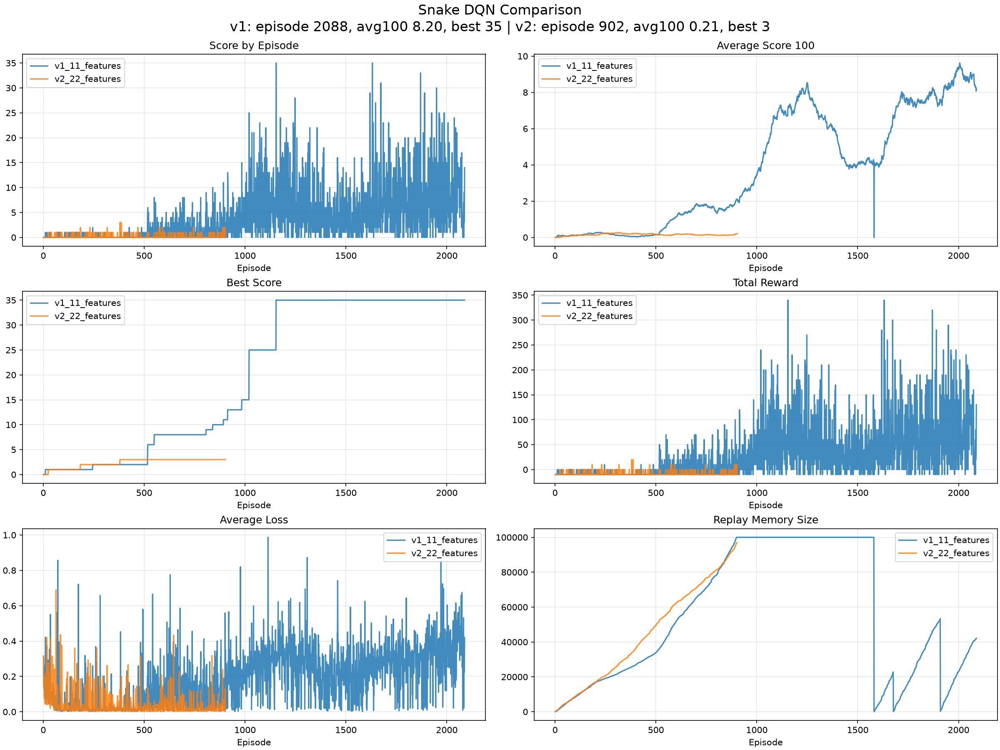
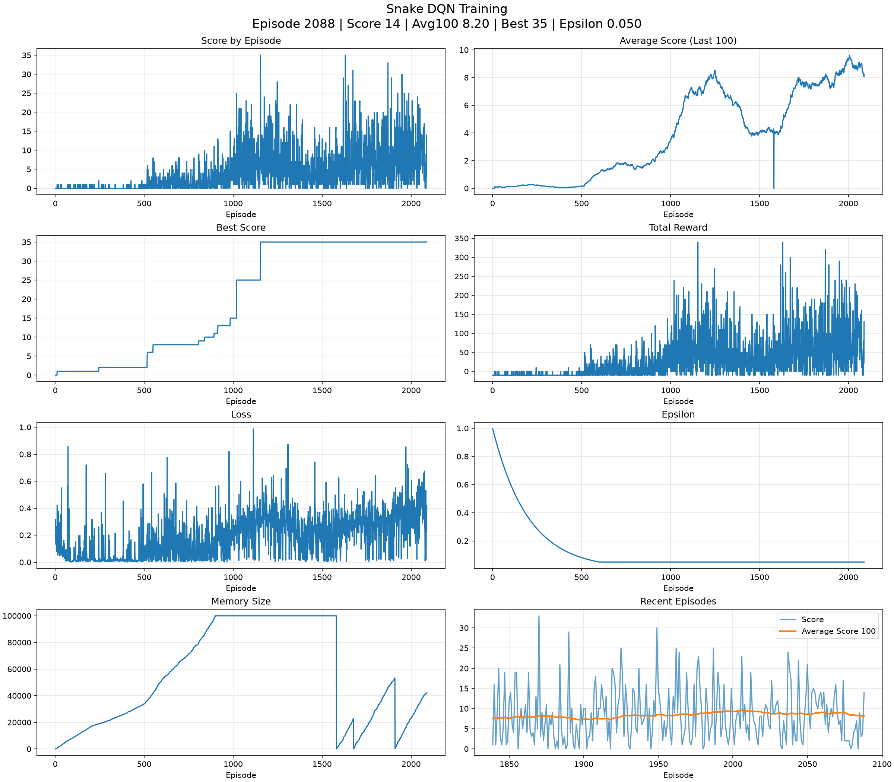
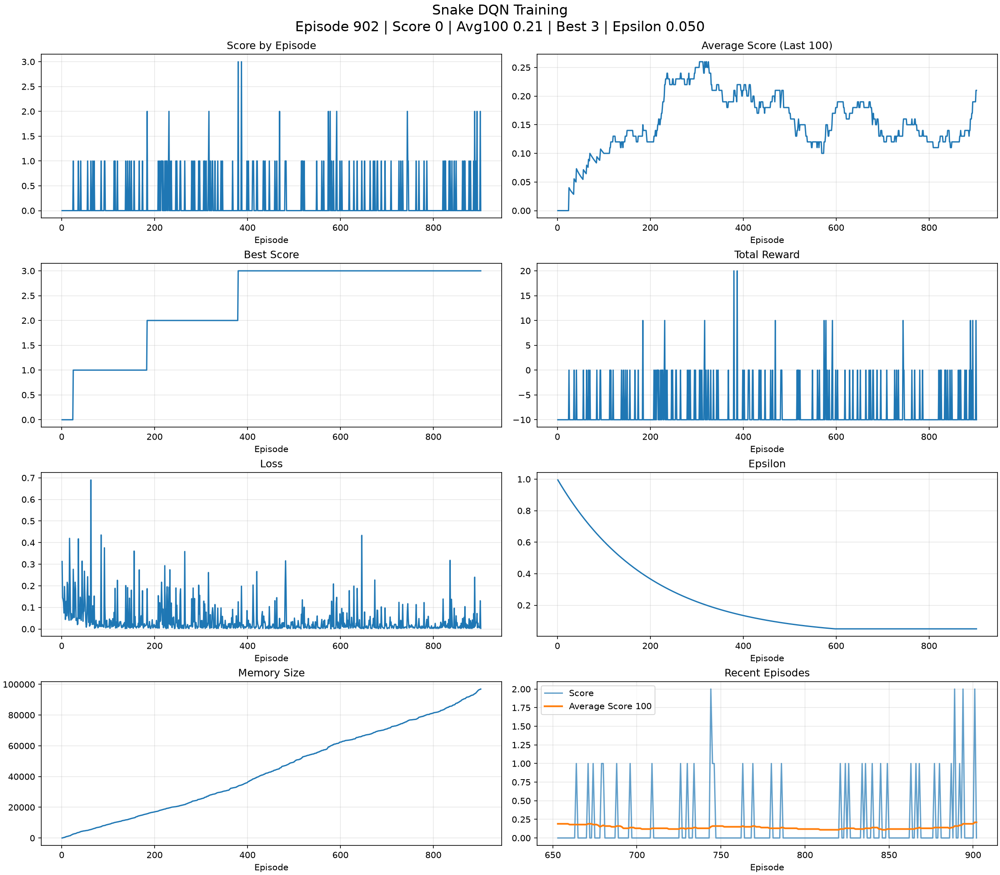

# Snake AI

Snake AI is a Python reinforcement learning project that turns a Pygame Snake environment into a Deep Q-Network training loop. The project focuses on making the RL pipeline inspectable: state features, actions, rewards, replay memory, checkpoints, CSV logs, and dashboards are all kept explicit.

## What This Project Demonstrates

- A playable Snake environment converted into an RL environment.
- Relative actions: straight, turn right, turn left.
- A random baseline agent.
- A PyTorch DQN agent with replay memory, target network updates, and epsilon-greedy exploration.
- Training and evaluation scripts.
- Checkpoint saving and resume support.
- CSV logging and Matplotlib dashboards.
- Experiment tracking for a stronger 11-feature v1 run and a later 22-feature v2 experiment.

## Current Status

This is an educational RL project, not a solved Snake bot.

The strongest run so far was the v1 11-feature DQN:

```text
episodes: 2088
best score: 35
final average_score_100: 8.20
```

The v2 22-feature experiment added lookahead and reachable-space features, but early results were worse:

```text
episodes: 902
best score: 3
final average_score_100: 0.21
```

That negative result is intentional to keep in the project history: richer state features do not automatically improve an RL agent without matching training changes.

## Visual Results

Comparison dashboard:



v1 dashboard:



v2 dashboard:



## Project Structure

```text
.
├── agent.py              # RandomAgent, DQNAgent, state feature extraction
├── compare_dashboard.py  # v1 vs v2 dashboard generator
├── config.py             # hyperparameters and experiment defaults
├── dashboard.py          # single-run dashboard generator
├── model.py              # LinearQNet and checkpoint helpers
├── snake_game.py         # Pygame Snake environment
├── train.py              # training and evaluation CLI
├── trainer.py            # Bellman target / DQN training step
├── PROJECT_HISTORY.md    # iteration log and experiment notes
└── requirements.txt
```

Generated artifacts are intentionally ignored by Git:

```text
logs/
checkpoints/
.venv/
__pycache__/
```

Curated dashboard snapshots are committed under `docs/assets/`.

## Setup

Create and activate a virtual environment:

```bash
python3 -m venv .venv
source .venv/bin/activate
```

Install dependencies:

```bash
pip install -r requirements.txt
```

## Run The Random-Agent Demo

```bash
python snake_game.py
```

## Train The Current v2 DQN

Headless training:

```bash
python train.py --episodes 500 --reset-logs
```

Visual training:

```bash
python train.py --episodes 0 --resume --render --speed 20 --log-decisions --decision-frequency 1
```

Stop safely with `Ctrl+C`. The latest checkpoint is saved before exit.

## Evaluate

Evaluate the current DQN checkpoint:

```bash
python train.py --eval --agent dqn --eval-episodes 100
```

Compare random baseline and DQN:

```bash
python train.py --eval --agent both --eval-episodes 100
```

## Dashboards

Generate the current experiment dashboard:

```bash
python dashboard.py
```

Generate the comparison dashboard after local v1 and v2 logs exist:

```bash
python compare_dashboard.py
```

## Notes For Reviewers

- Checkpoints and raw logs can become large, so they are excluded from Git.
- `PROJECT_HISTORY.md` records the major implementation iterations and experimental observations.
- The v2 model starts from scratch because its input size changed from 11 to 22.
- The next likely improvement is reward shaping or a revised feature design, not simply longer v2 training.
